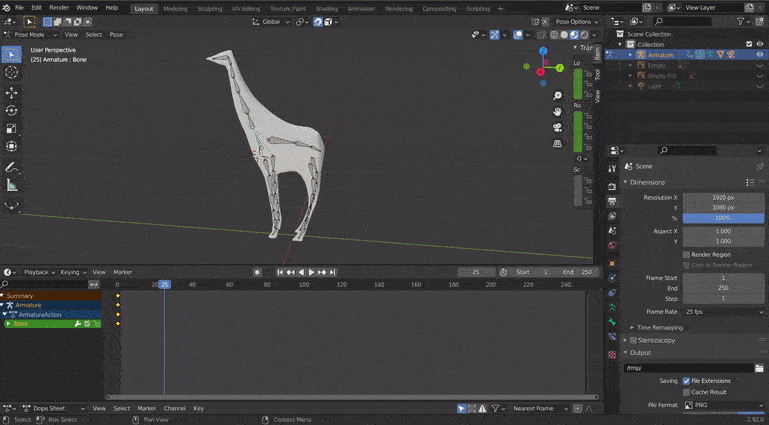

# 🌈

# ALL ABOUT RIGGING (Beginner)

 

### This Repository is all about rigging (not about the scene). Rigging is important if you want to export CUSTOM animated models from blender to the THREE JS scene.

##### I am not posting enough here because I have a private account for my advanced projects (so much to do), so I am doing my best to at least show my old projects here.

> I wish there was a way to **copy and paste** but Its blender, so Its taking ages to learn and to use it in my THREE JS SCENE, so here I present you the prototypes I ve made with my little knowledge.

 

# 🌵

### USEFUL LINKS BEFORE STARTING

> **The following two videos are really good** but to enjoy them i will advice you to check the others in the **2 list**, as they are good to help you familiarize with the syntax.

 

## 1\_ List

 

### (Totally beginner)

 

- **How to rig a human**
  [Let's Model a TRICERATOPS in 10 MINUTES (rigging bonus) - Blender 2.83 - Ep. 36](https://youtu.be/vVQ8Bq79UiM)

- **how to rig and animal with 4 legs**  
  [Let's Model a TRICERATOPS in 10 MINUTES (rigging bonus) - Blender 2.83 - Ep. 36](https://youtu.be/vVQ8Bq79UiM)

 

 

## 2\_ List

#### USEFUL LINKS TO LEARN HOW TO RIG / ANIMATE / EXPORT FBX

##### Slow and good for beginners :sunflower:

- REALLY GOOD to begin, he is slow and you can pretty much undertand everything, the example is really good to make a simple rigging and animation

[BASICS OF ANIMATION - Blender 2.8 - Part 3 - Bones & Armature](https://youtu.be/IAiTYaiZmY0)

 

##### fast / intermediate :sunflower:

- This one is very explicit and fast but can be a bit confusing

[Blender 2.8 Rigging Tutorial In 5 Minutes!](https://youtu.be/O1vhlTGP1-o)

#### Mirror Rig

- This one is from the same youtuber but faster than the other, so a bit more complicated as he dont focus that much in explaining the **why's** of certain things like in the previous video

[Blender 2.8 Mirror Armature In 20 Seconds!!!](https://youtu.be/ovzG9T5KKso)

 

##### Advanced :sunflower:

[Blender 2.82 : Advanced Rigging In 60 Seconds! (Double Joints)](https://youtu.be/JbQX8C3lrHE)

 

### Animate (video game style)

[Blender 2.8 Animating In 60 Seconds (Idle Animation)](https://youtu.be/1l1LBCtyh-8)

#### EXPORT 🔴

[Blender 2.8 Exporting FBXs to Unity 3D (In 60 Seconds!)](https://youtu.be/ysl0qYq5p9w)

 

 
 
 

# 🤖

# RIGGING

> **to make it easy**, change the view to the side

##### YOU CAN USE the numbers in your laptop (not the ones on the top)

- **(1)** will set the view to front, if you click **9** after you click **1** , it will give you the back view of the model (just the opposite direction)

- **(3)** will set the view to the side, if you click **9** after you click **3** , it will give you the opposite direction)

- **(7)** will set the view from the top, if you click **9** after you click **7** , it will give you the opposite direction)

- **4 / 6** helpful to turn the whole scene x axis and **8 / 2**

 

 

### Start by creating a bone

 

> position the view to side view or front view (its just a matter of what you are creating: human / animal / etc)

- **1** IN OBJECT MODE **PRESS SHIFT + A to open the menu. choose "armature" and then "single bone"** to create the first bone

> **NOTE** for the animals options you need to install the "rigging" add-On in **Edit**: Preferences

- IN EDIT MODE: **PRESS SHIFT + A** to create a bone

 
 

- **2** click on the bone and **drag it** to the place you want it inside the MODEL, keep in mind that the first bone will be the **root** bone in case you want to use it in **UNITY**.

 

- **3** You can move the whole bone by selecting it in the middle **or by selecting the spheres in each side of the bone**

  

- **4** Extrude BONES: **_press SHIFT + E or just E_** in your keyboard, from the moment you extrude the bone move it to the emplacement you want, you can also just click in a random place and then slect the spehere of the bone you just created.

> **(extrude: will create another bone out of the one you are selecting)**

 

## OR

- Move the 3d Cursor to the place you want press **SHIFT + RIGHT CLICK in the mouse** , it will bring the cursor up where you clicked, Once there **_press SHIFT + E or just E_**

- Now press shift to select the new bone you just created and at the same time **hold shift** to select a second bone, what you are doing here is **linking** the loner bone to the rest of the skeletton, so once these two bones are selected **press CTRL + P** and choose **keep offset**

 
 

- **5** To deconnect a bone **edit mode: PRESS ALT + P** (**there s a thin line that can be seen in case it worked**)

 
 

# :sunflower:

## LEARN HOW TO UNPARENT BONES

- **Select** the bone you want to unparent
   

- the bone has to be completely selected, not just a ball .

 

- then... once its selected, **GO TO THE left bar** where the modifiers and other icons are, **select the bone icon**

 
 

- ONCE THERE, select **relations** , then click on the **X**

> BY CLICKING ON THE X, you are removing the parenting between these bones

 
 

 

### ctrl + P: to connect

### alt + P: to deconnect

 

 

# :sunflower:

## NAMING THE BONES

> APPARENTLY you have to be very careful when naming the bones

- **1** select the bone and then go to the **Relations** and change the bone in the black input

 

 
 
 

# 🔴

 

# AXIS CURSOR / MIRROR ARMATURE ISSUE

> **ISSUES** when symmetrizing (once the new legs are done), the **cursor**, **yesterday i found a solution to for the mirrored legs that went into the inverse axis**

 

### Here are few links related to this issue:

[X-axis Mirror does not work properly](https://blender.stackexchange.com/questions/77850/x-axis-mirror-does-not-work-properly)

 

#### I will copy paste the answer before the delete it:

> X axis mirror is mirroring along X axis considering the origin point of the object (mesh or armature) is the center of the mirror:

##### here you see the cursor 3d in one of the feet, the goal is to put it in the center "between the 2 feet"

#### like you will see in the image below:

 

#### TO DO THIS I will have to:

- **1 SHIFT + Right Click** in the center of the 3d world (doesnt matter if it isn't perfect, that is the point)

- **2 In Object mode, open the object Menu:** object **+** snap **+** Cursor to World Origin

- **3 In Object mode again, open the object Menu:** object **+** Set Origin **+** Origin to 3D cursor

 

 
 
 

# Inverse kinematics

> **In computer animation and robotics, inverse kinematics is the mathematical process of calculating** the variable joint parameters needed to place the end of a kinematic chain ,(like when we place a finger on the nose, **the brain has to calculate WHAT ANGLE the shoulder should be, the Elbow, the hand and the fingers )** such as a robot manipulator or animation character's skeleton, in a given position and orientation relative to the start of the chain.

 
##### strange behavior

- Here I tested the bone in front of the front knee, first i positioned it in front of the front leg to see the results, then i deleted the process and i started it again, this time i positioned in the back, somehow the leg rotate to the oppsite direction following the Front Leg Pole.L bone 

 

 

 
 
 

# 🚀

# THE ANIMATION

### 1) Testing it with a model from [Mixamo](https://www.mixamo.com/)

 

- What is happening here is that the **W A S D** of the first component is clashing with the second **(I added 2 class components in the App.js just to see the kind of BUG it will make)**, I think its due to the camera, so every time i PRESS "w" i move forward with the first camera and the character move it as well.

- You can use the zebra to Observe the issue on the cameras

# :raised_hand_with_fingers_splayed:

- snake example

[BASICS OF ANIMATION - Blender 2.8 - Part 3 - Bones & Armature](https://youtu.be/IAiTYaiZmY0)

[BASICS OF ANIMATION - Blender 2.8 - Part 4 UNDERSTANDING RIGS](https://www.youtube.com/watch?v=nlT9rYcIRzU)

 
 

### 1) Testing it with a model I made in Blender

###### There s something wrong with the mirrored part of the model/mesh, when i try to animate it obviously the whole mirrored side FOLLOWS.

- **BUT I DONT CARE RIGHT NOW** For instance i ve started to test the animation, **in the future I will definitely do it better**

- Here I decided to animate **the Neck of the giraffe** just to see if it will work.

 

## PROCESS

### 🔥

- **1 in OBJECT MODE** select the Mesh first and then the skeleton, then **PRESS STRG+ P**, you will see the following MENU, choose **with automatic weights**

### go to pose "mode"

- **2 START** by giving it a pose, Go to **POSE MODE** (the bones have to be in blue when you select them) and once there select the bone you want to move, **this bone will serve as the location for a rotation, its like the bone that will stay static once all the rest move when you grab the bone for the location**

 

##### now select them all

- **PRESS A** to select all the bones (all the skeletton have to be in blue) , once the skeletton is in blue, **press right click** to open the menu **click on INSERT KEYFRAMES** then choose **"location and rotation"**, it has to be that one.

 

#### Change the frame rate per second

- start by moving hte blue line/bar to 25 secs then go to the right side and change it to 25 as well

- YOU CAN HAVE A **second menu** where the green tabs are (inside the keyframes stuff) , just dropdown like you normally do, you will see CROSS, once it s there bring it down

 

- ONce you do that , get ready to play with the keyframes settings on the bottom, there **press RECORD** (the little white dot close to the play button), ONCE CLICKED move the triangle dot (of the keyframes) to one second , it will mean that in between you will move the ANIMAL a few times, **REMEMBER**, Everytime you move you should **duplicate** the triangle dot of the keyframe.

 

#### to test it

- CLICK PLAY

## HERE I ADDED ANOTHER HALF SECOND OF MOVEMENTS

 
 
 
 

# DOG TEST / EXPORT

#### I quickly modeled this TO SEE if the fbx export worked and "yes" finally i could make it happen :)

- Here you can see that the front leg is moving independently, from the other leg on the front, the ones in the back i didnt care to test

#### I CAN add bones to the eyes of the dog to make it look more natural, that will be my next test and also the walk forward

> the little dog is not going to be added to the scene its just a test.
